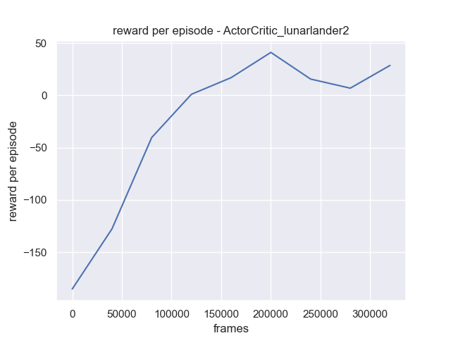
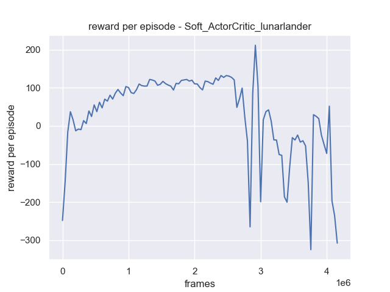

This project allows you to use all the most well known Reinforcement Learning algorithms on the gymnasium environment.

## Installation

To install the project, you need to clone the repository and install the requirements.

```bash
git clone
cd RL_gymnasium
pip install -r requirements.txt
```
For windows, often the gymnasium can only install if you have installed [Swig](http://www.swig.org/download.html) and added it to your path. Another common problem is the error "Microsoft Visual C++ 14.0 or greater is required". Here you can install microsoft build tools and install the necessary dependencies.

## Usage

To use the project, you run the main.py file. Here you can choose between the different methods (deep_q, REINFORCE, etc..) and the different environments (CartPole, LunarLander, etc...). All the hyper-parameters that you can tune is also in the main.py file. In general, it should be fairly straight forward to choose the parameters you want, as most of them are classes that displays their options or are just a number. You can go to the train_agents folder to have a look at the experiments that has already been run.

Here is a list of all the hyper-parameters and what they do:

- **name**: 
It is the name you give the experiment. The experiment will be saved in the trained_agents folder. If you choose a name which already exists it will be overwritten. A folder will be created with the model you are training, some performance graphs and a txt file of the used hyper-parameters. However, if you use eval mode the model and performance graphs will be loaded from the trained_agents folder instead.

- **train_loop**:
This parameter decides what kind of RL algorithm you want to use. It can also be set to eval which loads the folder with the name given and you can see it play.

- **exploration**:
This parameter decides how you want to choose your action. The reason for the name exploration is because in deep-q learning it often is associated with what exploration method you use (eg. epsilon greedy, greedy). However, in other train_loops it should be seen as more "how do i sample from the output of my model". So for a discrete REINFORCE train_loop you could choose Multinomial, and for a continious REINFORCE train_loop you could choose a normal distribution.

- **batch_size**:
When training, how big of a batch size do you want to use (if multiple models same batch_size is used).

- **learning_rate**:
The learning rate of the model(s).

- **weight_decay**:
The weight decay used in the ADAM optimizer(s).

- **trains_every_frame**:
How many times to you want to train for every step taken in the environment. It is recommended to run multiple environments in parallel (see below), and so it sometimes makes sense to train more than once per step.

- **train_after_frames**:
How many frames do you want to wait before you start training. This is useful if you want to collect some data before you start training. So you have some data from an approximately random policy before you start training, and so the data you train on when using a replay buffer is not too correlated.

- **buffer_size**:
Some methods uses a "normal" replay buffer (deep_q_learning, soft_actorcritic), and this parameter decides how big the buffer should be.

- **update_target_every_frames**:
Some methods uses a target network (eg. deep_q_learning), and this parameter decides how many frames you need to see before you update the target network.

- **episodes_before_train**:
Methods like REINFORCE finishes episodes before it can train. This parameter decided how many episodes you want to finish before you train on them. Usually this would be set to the number of environments you run in parallel, but it can be more.

-  **baseline_model**:
Some methods uses a baseline (eg. REINFORCE), and this parameter decides that. 

- **gamma**:
The discount factor used in the RL algorithms.

- **lambda_**:
The lambda used in the algorithms with eligibility traces.

- **sample_length**:
When training with eligibility traces samples are drawn of this length.

- **entropy_regulization**:
Some methods uses entropy regulization (REINFORCE, PPO, actor_critic, soft_actor_critic_learn), and this parameter decides how much of that entropy regulization you want to use.

- **epsilon_clip**:
For PPO you can clip the ratio between the new and old policy. This parameter decides the ratio of when you want to clip it.

- **epsilon_start**:
For epsilon greedy exploration, this parameter decides the starting epsilon.

- **epsilon_end**:
For epsilon greedy exploration, this parameter decides the ending epsilon.

- **decay_period_of_epsilon**:
For epsilon greedy exploration, this parameter decides how many frames you want to decay the epsilon over. (The decay is linear)

- **env_name**:
This parameter decides what environment you want to use. It is the name of the gymnasium environment.

- **render_mode**:
This parameter decides if you want to render the environment or not. It can be set to "human" or "None". Using "None" will not render the environment, but it will speed up the training significantly.

- **num_envs**:
This parameter decides how many environments you want to run in parallel.

- **save_every_frames**:
This parameter decides how often you want to save the model (and save performance for plots).

- **measure_performance_every**:
This parameter decides how often you want to measure the performance of the model. So you can get a smoother plot and not save too much data.


In general, not all combinations of hyper-parameters is able to run. For example, not all environments has a continious version, so choosing continuous on a non-continious version might crash the program. Likewise, choosing you want to sample actions from a normal-distribution given you have a discrete action space will also crash the program. However, the program should be able to handle most of the combinations. Additionally, some hyper-parameter configurations could also cause the program to crash. Eg. A too high learning rate could make some models diverge. This is especially a potential issue in the monte carlo methods, as the variance is quite high here.

## Details
The PPO implementation follows the original paper https://arxiv.org/pdf/1707.06347.pdf with regulization entropy. There are two versions implemented. The first uses seperate networks for the actor and advantage estimates, the second version uses a dual net. I got the best performance with the dual net.

The soft actor critic implementation follows this https://spinningup.openai.com/en/latest/algorithms/sac.html. Which uses two Q-functions rather than a V-function as in the original paper which is found here https://spinningup.openai.com/en/latest/algorithms/sac.html.

The project is build up in the following way:

- **main.py**:
Is the front-end of the project. Here you can choose the hyper-parameters and what you want to train. It simply runs the "run" function with your class of arguments.

- **helpers.py**:
This file has the run function, which just takes care of the arguments and runs the correct function. It also saves the hyper-parameters in a txt file.
helpers also have other helpful function to make the code more readable.

- **game_loops.py**:
Here all the gameloops are. Most of them look similar (have a take_action, step, train, collect), but they vary to some extent.

- **agent.py**:
This file has all the different agents and their training methods. There is a superclass, Agent, that holds much of the attributes all the agents has in common. Then there is a subclass of this class called Actor_agent, which carries the common charateristics of the policy gradient methods. I tried to fit all the other agents under these two umbrella classes as much as possible. An agent has a network and an exploration tool which enables it to sample actions. Not all agents use their exploration tool (eg. the Baseline agent is used only to evaluate). 

short description of the agents:

I implemented two versions of PPO. Which differs in their networks and in when they train. Each of the versions has it's own game-loop. As the first version trains after a certain amount of episodes, and the second version trains after a certain amount of frames.

1. **QAgent**:
This agent is used in Q learning and outputs Q values for each actions. It is trained with double Q learning.
2. **REINFORCE_Agent**:
Trained via the standard REINFORCE algorithm using monte carlo returns. It can use a baseline network for advantage estimation to reduce variance.
3. **Actorcritic_critic**:
This is the critic for the actorcritic algorithm. It is similar to the QAgent, but it can use eligibility traces.
4. **Actorcritic_actor**:
Thsi is the actor for the actorcritic algorithm. It also uses eligibility traces, the critic and the actor are trained together in this agents train loop.
5. **BaselineAgent**:
This is simply an agent with a network that goes from state to value.
6. **PPO_Agent**:
This agent is trained with the PPO algorithm after each episode. It uses a seperate network for the actor part and the Q-value estimation. My experience with this PPO_Agent is not great, it's performance can be seen in "PPO_cartpole" and "PPO_lunarlander".
7. **PPO_dual_network_Agent**:
This agent is trained with the PPO algorithm after a certain amount of frames, and then trained a certain amount of frames. It uses a dual network for the actor part and the Q-value estimation. My experience with this PPO_Agent is much better, it's performance is seen in the "PPO_lunarlander_batch" folders. the gameloop for this algorithm is hardcoded to run 40000 frames before training 400 times with batch size. (just arbitrary numbers I found to work well)
8. **Soft_actorcritic_critic**:
This is the Q-value estimation of the SAC algorithm. It takes as input the action and state, and outputs the Q-value. This makes it able to work on continious action spaces, where a normal Q-value estimation (output Q-values for each action) would not work.
9. **Soft_actorcritic_actor**:
This is the actor of the SAC algorithm. It takes as input the state, and outputs the action. It follows the OpenAI implementation by ouputting a mean and standard deviation from each action, using the reparametization trick to draw the action from the normal distribution, and finally applies the tanh in order to ensure the drawn action is within the action space. For the other continious algorithms, the action is simply drawn from a normal distribution with a diagonal covariance matrix with a standard deviation of 0.1, and only the mean is modelled.


- **exploration.py**:
This file holds a class which holds all the exploration methods. This makes it easy to choose what exploration method you want to use. There are the epsilon greedy variants for the Q-learning, and for policy gradient methods the multinomial for discrete and normal distribution with and without standard deviation for continuous.

- **networks.py**:
This file holds all the networks. They are all very similar, and differs mostly in input and output size, or whether they apply a tanh or softmax in the end. They are all feed forward networks with 2 hidden layers. When running experiments you don't need to worry about this file, as the agents will automatically create the correct network for you.

- **replay_buffer.py**:
This holds the replay buffers. There are two types. A normal one used in Q-learning and to train the Q estimators in SAC. When sampling from this buffer random samplers are just drawns. The other type is called an episodic buffer. This one holds all the most recent episodes, and keeps track of which of them are done, so it can say that it is ready to train when a sufficient amount of episodes are done. This is used in the policy gradient methods.

- **collector.py**:
This file just contains the collector class which calculates the stats of the agent. It is used to display the performance plots.


When running main.py, if the train_loop is set to eval, it will automatically set the settings for the experiment that you want to see correctly.

## Results

Here are some results from the experiments, running on LunarLander-v2. Don´t mind some of the title names, it's simply because I forgot to change it before running the experiment.

## Q-learning


## REINFORCE

Discrete action space:


Continuous action space:


## Actorcritic

Discrete action space:



Continuous action space:


## PPO

Discrete action space:


Continuous action space:


## SAC




